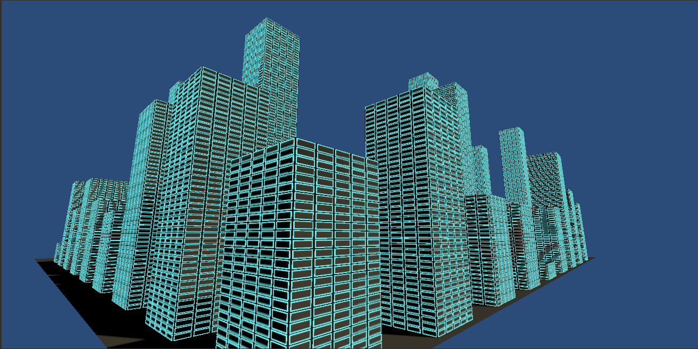
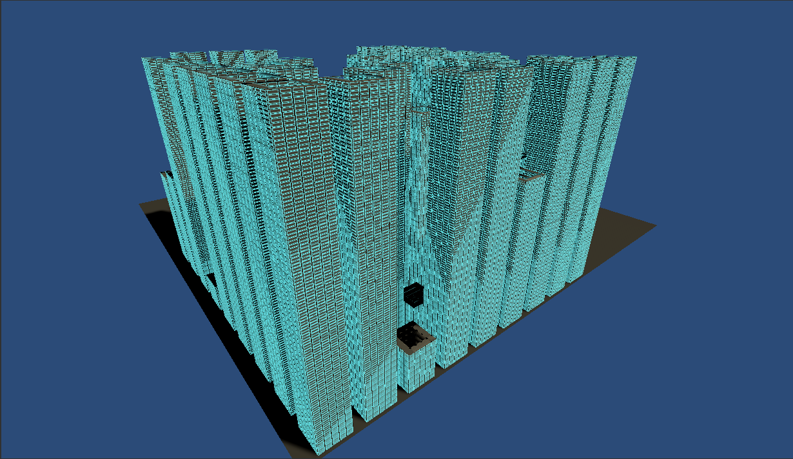
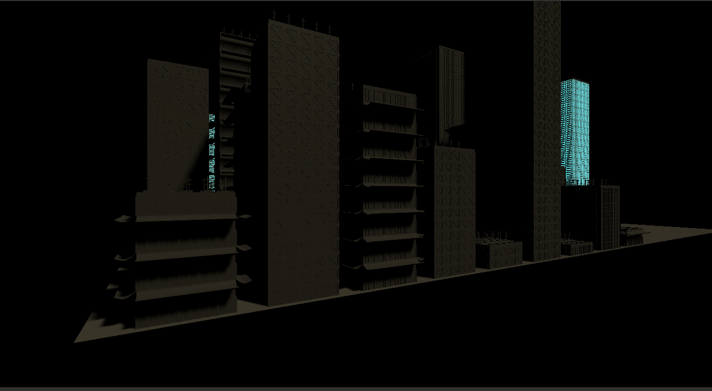

# TightCity
School project to procedurally generate a city.

This city is based on: NightCity 

Source: https://www.cyberpunk.net/us/en/

# Progress so far.

This is our first iteration of our prototype.

This is our second iteration of our prototype.

This is a more final screenshot just needs some last things.
